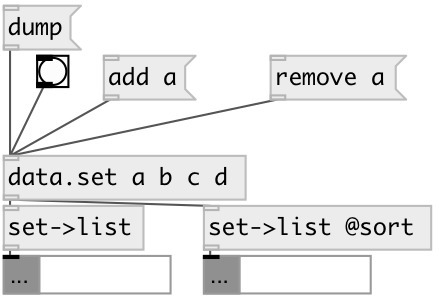

[index](index.html) :: [data](category_data.html)
---

# data.set2list
**aliases:** [ceammc/set-&gt;list], [set-&gt;list]

###### converts set to list

*available since version:* 0.3

---

## information
Note: output list is not sorted by default. You can use @sort flag to get sorted output

## properties:

* **@sort** 
Get/set if specified - sort output list 
_type:_ flag 
_default:_ 0 

## inlets:

* input set 
_type:_ control

## outlets:

* output list 
_type:_ control

## keywords:

[data](keywords/data.html)
[set](keywords/set.html)
[list](keywords/list.html)

**See also:**
[\[data.set\]](data.set.html)

**Authors:** Serge Poltavsky

**License:** GPL3 or later

