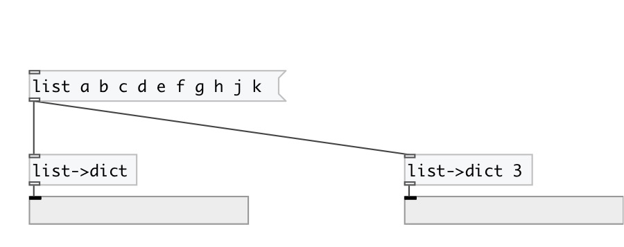

[< reference home](index.html)
---

# dict.from_list

creates dictionary from list

---

Convertion depends on property @step, which means a length of key/value pair.
            First element of the pair becames a key, and other elements becames value.
 

---

---
arguments:

STEP: key/value length in input list 

---
properties:

@step: key/value length in input
            list 

---
see also: 

