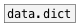

# dict.from_list

```


[list a b c d e f g h j k  (
|                          |
|                          |
|                          |
[list->dict]               [list->dict 3]
|                          |
[ui.d]                     [ui.d]

            
```
---
arguments:

STEP: key/value length in input list<br>

---
properties:

@step: key/value length in input
            list<br>

see also:<br>

