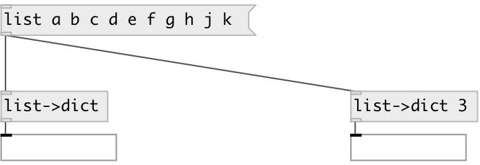

[index](index.html) :: [data](category_data.html)
---

# dict.from_list
**aliases:** [ceammc/list-&gt;dict], [list-&gt;dict]

###### creates dictionary from list

*available since version:* 0.7

---

## information
Convertion depends on property @step, which means a length of key/value pair. First element of the pair becames a key, and other elements becames value.

## arguments:

* **STEP**
key/value length in input list 
_type:_ int 

## properties:

* **@step** 
Get/set key/value length in input list 
_type:_ int 
_min value:_ 2 
_default:_ 2 

## inlets:

* input 
_type:_ control

## outlets:

* dict output 
_type:_ control

## keywords:

[dictionary](keywords/dictionary.html)

**See also:**
[\[data.dict\]](data.dict.html)

**Authors:** Serge Poltavsky

**License:** GPL3 or later

