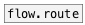

[< reference home](ceammc_lib.html)
---

# dict.get


output dict values

---

<br>


---


```


[\[a: b @prop: val 1: 100\], bang(
|
|
|
[data.dict]
|
[dict.get "@prop" "1" a "?"]
|     ^|    ^^|   ^^^|
|      |      |      |
|      |      |      |
[S]    [F]    [S]    [ui.display]

            
```

---
arguments:

KEYS: keys<br>

---
properties:

@keys: extracted keys<br>
@default: default value when key is not found in
            dictionary. If not specified no output is performed.<br>

---
see also:<br>
[](data.dict.html)
[](flow.route.html)
