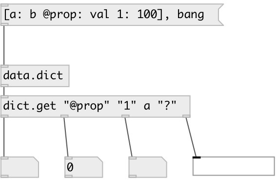

[index](index.html) :: [data](category_data.html)
---

# dict.get

###### output dict values

*available since version:* 0.6

---

## arguments:

* **KEYS**
keys 
__type:__ list 

## properties:

* **@keys** 
Get/set extracted keys 
__type:__ list 

* **@default** 
Get/set default value when key is not found in dictionary. If not specified no output
is performed. 
__type:__ atom 

## inlets:

* input dictionary 
__type:__ control 

## outlets:

* first key output
__type:__ control 
* ... key output
__type:__ control 
* nth key output
__type:__ control 

## keywords:

[get](keywords/get.html)
[dictionary](keywords/dictionary.html)

**See also:**
[\[data.dict\]](data.dict.html)
[\[flow.route\]](flow.route.html)

**Authors:** Serge Poltavsky

**License:** GPL3 or later

