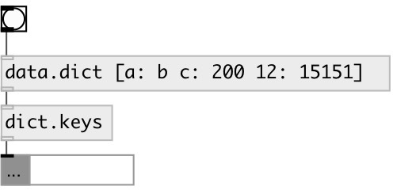

[index](index.html) :: [data](category_data.html)
---

# dict.keys

###### get list of dict keys

*available since version:* 0.6

---

## inlets:

* data.dict 
_type:_ control

## outlets:

* list of dict keys 
_type:_ control

## keywords:

[list](keywords/list.html)
[keys](keywords/keys.html)
[dictionary](keywords/dictionary.html)

**See also:**
[\[data.dict\]](data.dict.html)
[\[dict.values\]](dict.values.html)

**Authors:** Serge Poltavsky

**License:** GPL3 or later

