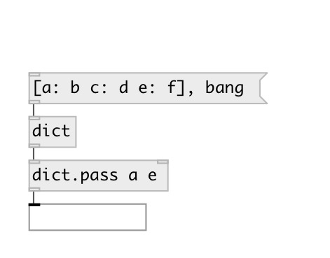

[index](index.html) :: [data](category_data.html)
---

# dict.pass

###### passes specified keys in dict

*available since version:* 0.7

---

## arguments:

* **KEYS**
keys 
_type:_ list 

## properties:

* **@keys** 
Get/set passed keys 
_type:_ list 

## inlets:

* input dictionary 
_type:_ control
* set passed keys 
_type:_ control

## outlets:

* dict with passed keys 
_type:_ control

## keywords:

[pass](keywords/pass.html)
[dictionary](keywords/dictionary.html)

**See also:**
[\[data.dict\]](data.dict.html)

**Authors:** Serge Poltavsky

**License:** GPL3 or later

