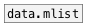

[< reference home](ceammc_lib.html)
---

# dict.values


dictionary values as mlist

```


[B]
|
[data.dict \[bpm: 120 title: "Unknown masterpiece" freqs: 1 2 3 4\]]
|
|
|
[dict.values  ]
|
[ui.display @display_type=1]

            
```

---
arguments:


---
properties:


---
see also:<br>
[](data.dict.html)
[](data.mlist.html)
[](dict.keys.html)
