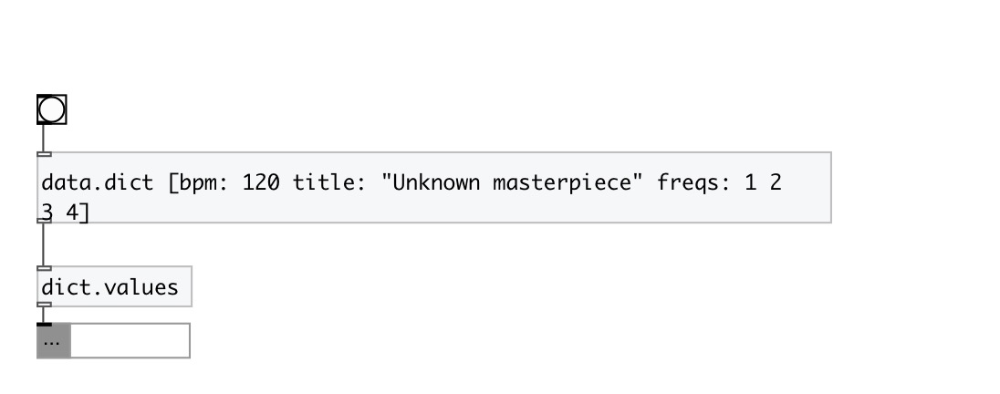

[index](index.html) :: [data](category_data.html)
---

# dict.values

###### dictionary values as mlist

*available since version:* 0.6

---

## inlets:

* data.dict 
_type:_ control

## outlets:

* mlist of values 
_type:_ control

## keywords:

[size](keywords/size.html)
[dictionary](keywords/dictionary.html)

**See also:**
[\[data.dict\]](data.dict.html)
[\[data.mlist\]](data.mlist.html)
[\[dict.keys\]](dict.keys.html)

**Authors:** Serge Poltavsky

**License:** GPL3 or later

