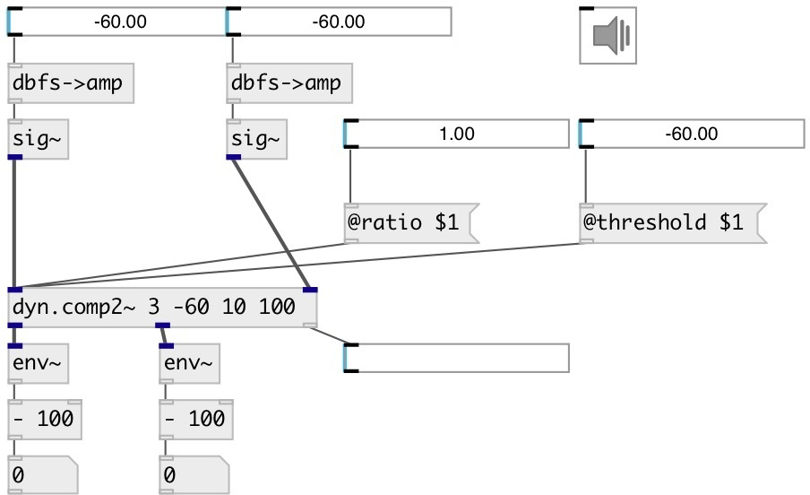

[index](index.html) :: [dyn](category_dyn.html)
---

# dyn.comp2~

###### stereo dynamic range compressor

*available since version:* 0.1

---

## arguments:

* **RATIO**
compression ratio (1 = no compression, &gt;1 means compression) 
_type:_ float 

* **THRESHOLD**
level threshold above which compression kicks in (100 dB = max level) 
_type:_ float 
_units:_ db 

* **ATTACK**
attack time = time constant when level &amp; compression going up 
_type:_ float 
_units:_ ms 

* **RELEASE**
release time = time constant coming out of compression 
_type:_ float 
_units:_ ms 

## properties:

* **@ratio** 
Get/set compression ratio (1 = no compression, &gt;1 means compression) 
_type:_ float 
_range:_ 1..10 
_default:_ 1 

* **@threshold** 
Get/set level threshold above which compression kicks in (100 dB = max level) 
_type:_ float 
_units:_ db 
_range:_ 0..100 
_default:_ 100 

* **@attack** 
Get/set time constant when level &amp; compression going up 
_type:_ float 
_units:_ ms 
_range:_ 1..100 
_default:_ 10 

* **@release** 
Get/set release time = time constant coming out of compression 
_type:_ float 
_units:_ ms 
_range:_ 1..500 
_default:_ 50 

* **@gain** 
Get/set make up gain: applied to the signal after the compression takes place 
_type:_ float 
_units:_ db 
_range:_ -12..12 
_default:_ 0 

* **@active** 
Get/set on/off dsp processing 
_type:_ bool 
_default:_ 1 

## inlets:

* left input signal 
_type:_ audio
* right input signal 
_type:_ audio

## outlets:

* left output signal 
_type:_ audio
* right output signal 
_type:_ audio

## keywords:

[compressor](keywords/compressor.html)

**See also:**
[\[dyn.comp~\]](dyn.comp~.html)

**Authors:** Alex Nadzharov, Serge Poltavsky

**License:** GPL3 or later

