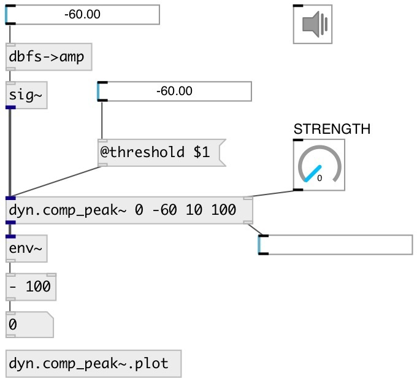

[index](index.html) :: [dyn](category_dyn.html)
---

# dyn.comp_peak~
**aliases:** [comp.peak\~]

###### mono dynamic range peak feed forward compressor

*available since version:* 0.9.7

---

## information
It uses a strength parameter instead of the traditional ratio, in order to be able to function as a hard limiter or overcompressor

## arguments:

* **STRENGTH**
compression strength (0: no compression, 1: hard limiting, &gt;1: overcompression) 
_type:_ float 

* **THRESHOLD**
level threshold above which compression kicks in 
_type:_ float 
_units:_ db 

* **ATTACK**
attack time = time constant when level &amp; compression going up 
_type:_ float 
_units:_ ms 

* **RELEASE**
release time = time constant coming out of compression 
_type:_ float 
_units:_ ms 

## methods:

* **reset**
reset to initial state 

## properties:

* **@strength** 
Get/set compression ratio (0: no compression, 1: hard limiting, &gt;1: overcompression) 
_type:_ float 
_range:_ 0..2 
_default:_ 0 

* **@threshold** 
Get/set level threshold above which compression kicks in (100 dB = max level) 
_type:_ float 
_units:_ db 
_range:_ -60..0 
_default:_ -10 

* **@attack** 
Get/set time constant when level &amp; compression going up 
_type:_ float 
_units:_ ms 
_range:_ 0.1..100 
_default:_ 10 

* **@release** 
Get/set release time = time constant coming out of compression 
_type:_ float 
_units:_ ms 
_range:_ 1..500 
_default:_ 50 

* **@gain** 
Get/set make up gain: applied to the signal after the compression takes place 
_type:_ float 
_units:_ db 
_range:_ -18..18 
_default:_ 0 

* **@knee** 
Get/set a gradual increase in gain reduction around the threshold: below
thresh-(knee/2) there is no gain reduction, above thresh+(knee/2) there is the
same gain reduction as without a knee, and in between there is a gradual
increase in gain reduction 
_type:_ float 
_units:_ db 
_range:_ 0..24 
_default:_ 3 

* **@bypass** 
Get/set bypass flag. If true: bypass &#39;effected&#39; signal. 
_type:_ bool 
_default:_ 0 

* **@level** (readonly)
Get current level of compression 
_type:_ float 
_range:_ 0..1 
_default:_ 0 

* **@refresh** 
Get/set compression level output time interval. If 0 - no output 
_type:_ int 
_units:_ ms 
_range:_ 0..1000 
_default:_ 100 

* **@active** 
Get/set on/off dsp processing 
_type:_ bool 
_default:_ 1 

* **@osc** (initonly)
Get/set OSC server name to listen 
_type:_ symbol 

* **@id** (initonly)
Get/set OSC address id. If specified, bind all properties to
/ID/dyn_comp_peak/PROP_NAME osc address, if empty bind to
/dyn_comp_peak/PROP_NAME. 
_type:_ symbol 

## inlets:

* input signal 
_type:_ audio
* set compression strength 
_type:_ control

## outlets:

* output compressed signal 
_type:_ audio
* float: output current compression level in [0..1] 
_type:_ control

## keywords:

[compressor](keywords/compressor.html)

**See also:**
[\[dyn.comp_peak2~\]](dyn.comp_peak2~.html)

**Authors:** Serge Poltavsky

**License:** GPL3 or later

