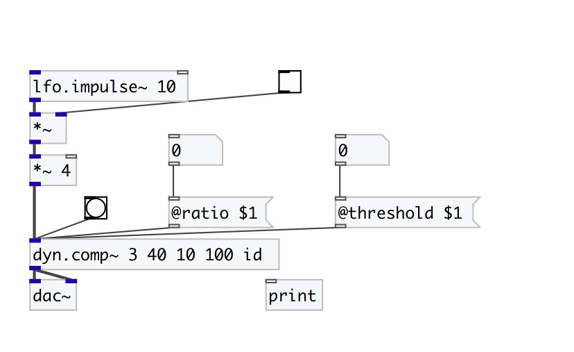
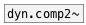

[< reference home](index.html)
---

# dyn.comp~

mono dynamic range compressors

---

 

---

---
arguments:

ratio: compression ratio (1 = no compression,
            &gt;1 means compression) 
threshold(db): 
            level threshold above which compression kicks in (100 dB = max level) 
attack(ms): attack time = time constant
            when level &amp; compression going up 
release(ms): release time = time constant
            coming out of compression 
ID: object ID for OSC control path 

---
properties:

@ratio: compression
            ratio (1 = no compression, &gt;1 means compression) 
@threshold(db): level threshold above which compression kicks in (100 dB = max
            level) 
@attack(ms): time constant when level &amp; compression going up 
@release(ms): release time = time constant coming out of compression 
@active: on/off dsp
            processing 

---
see also: 

