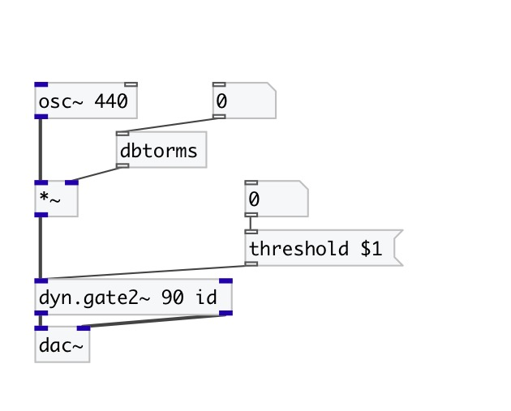

[< reference home](index.html)
---

# dyn.gate2~

stereo signal gate

---

 

---

---
arguments:

threshold(db): dB
            level threshold above which gate opens (e.g., 40 dB) 
attack(ms): 
            attack time = time constant (ms) for gate to open 
hold(ms): hold
            time = time (ms) gate stays open after signal level &lt; threshold 
release(ms): 
            release time = time constant (ms) for gate to close 
ID: object ID for OSC control path 

---
properties:

@threshold(db): dB level threshold above which gate opens 
@attack(ms): attack time = time constant (ms) for gate to open 
@hold(ms): hold time = time (ms) gate stays open after signal level &lt;
            threshold 
@release(ms): release time = time constant (ms) for gate to close 
@active: on/off dsp
            processing 

---
see also: 

