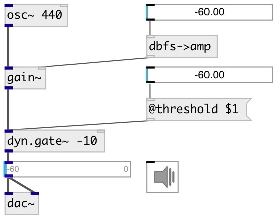

[index](index.html) :: [dyn](category_dyn.html)
---

# dyn.gate~

###### mono signal gate

*available since version:* 0.1

---

## arguments:

* **threshold**
dB level threshold above which gate opens (e.g., 40 dB) 
__type:__ float 
__units:__ db 

* **attack**
attack time = time constant (ms) for gate to open 
__type:__ float 
__units:__ ms 

* **hold**
hold time = time (ms) gate stays open after signal level &lt; threshold 
__type:__ float 
__units:__ ms 

* **release**
release time = time constant (ms) for gate to close 
__type:__ float 
__units:__ ms 

* **ID**
object ID for OSC control path 
__type:__ symbol 

## properties:

* **@threshold** 
Get/set dB level threshold above which gate opens 
__type:__ float 
__units:__ db 
__range:__ 0..100 
__default:__ 40 

* **@attack** 
Get/set attack time = time constant (ms) for gate to open 
__type:__ float 
__units:__ ms 
__range:__ 0..500 
__default:__ 0.1 

* **@hold** 
Get/set hold time = time (ms) gate stays open after signal level &lt; threshold 
__type:__ float 
__units:__ ms 
__range:__ 1..500 
__default:__ 100 

* **@release** 
Get/set release time = time constant (ms) for gate to close 
__type:__ float 
__units:__ ms 
__range:__ 1..500 
__default:__ 20 

* **@active** 
Get/set on/off dsp processing 
__type:__ int 
__enum:__ 0, 1 
__default:__ 1 

## inlets:

* input signal 
__type:__ audio 

## outlets:

* output signal
__type:__ audio 

## keywords:

[gate](keywords/gate.html)

**See also:**
[\[dyn.gate2~\]](dyn.gate2~.html)

**Authors:** Alex Nadzharov, Serge Poltavsky

**License:** GPL3 or later

