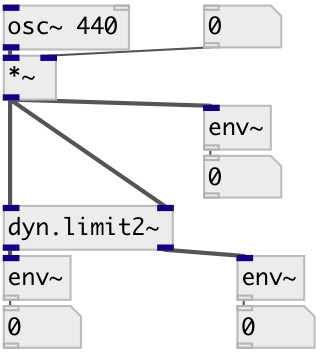

[index](index.html) :: [dyn](category_dyn.html)
---

# dyn.limit2~

###### stereo 1176LN Peak Limiter

*available since version:* 0.1

---

## properties:

* **@active** 
Get/set on/off dsp processing 
_type:_ bool 
_default:_ 1 

## inlets:

* left input signal 
_type:_ audio
* right input signal 
_type:_ audio

## outlets:

* left output signal 
_type:_ audio
* right output signal 
_type:_ audio

## keywords:

[limiter](keywords/limiter.html)

**See also:**
[\[dyn.limit~\]](dyn.limit~.html)
[\[dyn.comp~\]](dyn.comp~.html)

**Authors:** Alex Nadzharov, Serge Poltavsky

**License:** GPL3 or later

