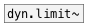
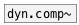

[< reference home](ceammc_lib.html)
---

# dyn.limit2~


stereo 1176LN Peak Limiter

```


[osc~ 440]  [floatatom]
|           |.
[*~           ]
| |         |
| |         [env~]
| |         |
| |         [floatatom]
| |.
[dyn.limit2~   ]
|             ^|
[env~]        [env~]
|             |
[floatatom]   [floatatom]

            
```

---
arguments:


---
properties:


---
see also:<br>
[](dyn.limit~.html)
[](dyn.comp~.html)
