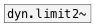

[<<< reference home](ceammc_lib.md)
---

# dyn.limit~

```


[osc~ 440]  [floatatom]
|           |.
[*~          ]
| |
| [env~]
| |
| [floatatom]
|
[dyn.limit~]
|
[env~]
|
[floatatom]

            
```
---
mono 1176LN Peak Limiter
---
arguments:


---
properties:


---
see also:<br>
[](dyn.limit2~.md)
[](dyn.comp~.md)
