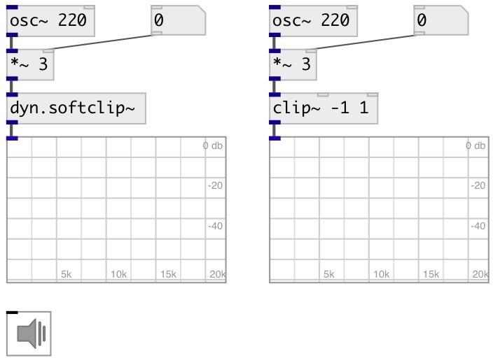

[index](index.html) :: [dyn](category_dyn.html)
---

# dyn.softclip~

###### soft signal clip

*available since version:* 0.1

---

## methods:

* **reset**
reset to initial state 

## properties:

* **@active** 
Get/set on/off dsp processing 
_type:_ bool 
_default:_ 1 

## inlets:

* input signal 
_type:_ audio

## outlets:

* output signal 
_type:_ audio

## keywords:

[dyn](keywords/dyn.html)
[clip](keywords/clip.html)
[limiter](keywords/limiter.html)

**Authors:** Alex Nadzharov

**License:** GPL3 or later

