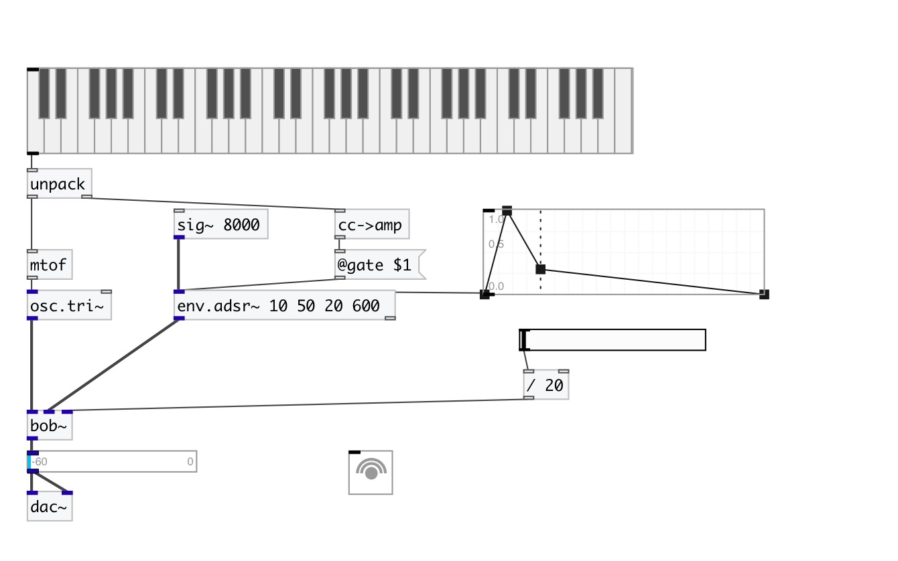

[< reference home](index.html)
---

# env.adsr~

ADSR (Attack, Decay, Sustain, Release) envelope generator

---

 

---

---
arguments:

attack(ms): attack
            time 
decay(ms): decay
            time 
sustain(%): 
            sustain level (percentage of trigger) 
release(ms): release
            time 

---
properties:

@attack(ms): attack time 
@decay(ms): decay time 
@sustain(%): sustain level - percent from trigger signal 
@release(ms): release time 
@gate: trigger. If
            &gt; 0 - starts envelope. 
@adsr: attack decay sustain release
            tuple 
@active: on/off dsp
            processing 

