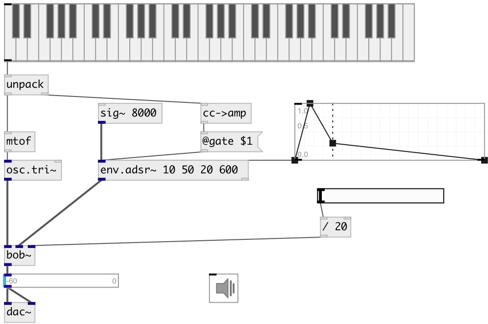

[index](index.html) :: [env](category_env.html)
---

# env.adsr~

###### ADSR (Attack, Decay, Sustain, Release) envelope generator

*available since version:* 0.7

---

## arguments:

* **attack**
attack time 
_type:_ float 
_units:_ ms 

* **decay**
decay time 
_type:_ float 
_units:_ ms 

* **sustain**
sustain level (percentage of trigger) 
_type:_ float 
_units:_ % 

* **release**
release time 
_type:_ float 
_units:_ ms 

## methods:

* **play**
runs envelope and release it after specified time 
  __parameters:__
  - **[DUR]** duration 
    type: float  

* **reset**
reset envelope to initial state 

## properties:

* **@attack** 
Get/set attack time 
_type:_ float 
_units:_ ms 
_range:_ 0..100000 
_default:_ 10 

* **@decay** 
Get/set decay time 
_type:_ float 
_units:_ ms 
_range:_ 0..100000 
_default:_ 10 

* **@sustain** 
Get/set sustain level - percent from trigger signal 
_type:_ float 
_units:_ % 
_range:_ 0..100 
_default:_ 50 

* **@release** 
Get/set release time 
_type:_ float 
_units:_ ms 
_range:_ 0..100000 
_default:_ 300 

* **@gate** 
Get/set trigger. If &gt; 0 - starts envelope. 
_type:_ float 
_range:_ 0..1 
_default:_ 0 

* **@adsr** (readonly)
Get attack decay sustain release tuple 
_type:_ list 

* **@active** 
Get/set on/off dsp processing 
_type:_ int 
_enum:_ 0, 1 
_default:_ 1 

## inlets:

* input signal 
_type:_ audio

## outlets:

* output signal with applied envelope 
_type:_ audio
* outputs 1 when attack/decay phase finished, 0 - when release phase finished 
_type:_ control

## keywords:

[envelope](keywords/envelope.html)
[adsr](keywords/adsr.html)

**Authors:** Serge Poltavsky

**License:** GPL3 or later

