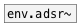

# env.ar~

```


[osc.tri~ 1500] [msg.onload]
|               |
|               [ar 300 8(
|               |
|               [ui.env @size 200 70]
|               |
|               |
|               |
|               |
|   [B]         |
|   |           |
[env.ar~ 10 600  ]
|           ^|
|           [B]
|
[ui.gain~ @size 140 16] [ui.dsp~]
|\
[dac~]

            
```
---
arguments:

attack(ms): attack time<br>
release(ms): release time<br>

---
properties:

@attack(ms): attack time<br>
@release(ms): release time<br>
@gate: trigger signal<br>
@ar: attack release pair<br>
@length(ms): envelope length<br>
@active: on/off dsp
            processing<br>

see also:<br>

