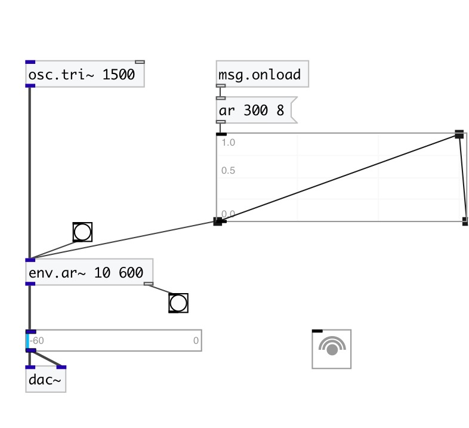

[< reference home](index.html)
---

# env.ar~

Attack/Release envelope generator

---

click on object to activate envelope
 

---

---
arguments:

attack(ms): attack time 
release(ms): release time 

---
properties:

@attack(ms): attack time 
@release(ms): release time 
@gate: trigger signal 
@ar: attack release pair 
@length(ms): envelope length 
@active: on/off dsp
            processing 

---
see also: 

