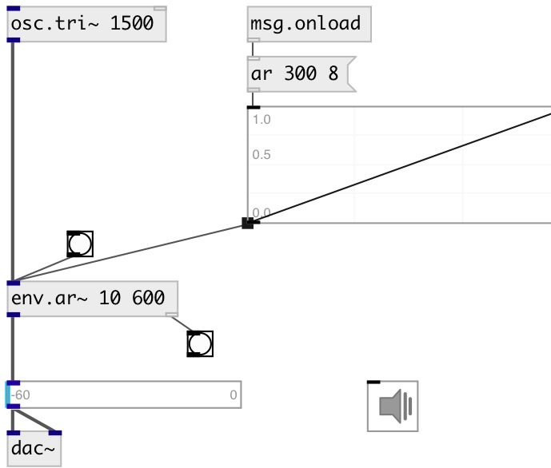

[index](index.html) :: [env](category_env.html)
---

# env.ar~

###### Attack/Release envelope generator

*available since version:* 0.7

---

## information
click on object to activate envelope

## arguments:

* **attack**
attack time 
__type:__ float 
__units:__ ms 

* **release**
release time 
__type:__ float 
__units:__ ms 

## methods:

* **play**
run envelope 

* **reset**
reset envelope to initial state 

## properties:

* **@attack** 
Get/set attack time 
__type:__ float 
__units:__ ms 
__range:__ 0..100000 
__default:__ 10 

* **@release** 
Get/set release time 
__type:__ float 
__units:__ ms 
__range:__ 0..100000 
__default:__ 300 

* **@gate** 
Get/set trigger signal 
__type:__ int 
__enum:__ 0, 1 
__default:__ 0 

* **@ar** (readonly)
Get attack release pair 
__type:__ list 

* **@length** (readonly)
Get envelope length 
__type:__ float 
__units:__ ms 
__default:__ 310 

* **@active** 
Get/set on/off dsp processing 
__type:__ int 
__enum:__ 0, 1 
__default:__ 1 

## inlets:

* input signal 
__type:__ audio 

## outlets:

* output signal with applied envelope
__type:__ audio 
* bang on done
__type:__ control 

## keywords:

[envelope](keywords/envelope.html)
[ar](keywords/ar.html)

**See also:**
[\[env.adsr~\]](env.adsr~.html)

**Authors:** Serge Poltavsky

**License:** GPL3 or later

