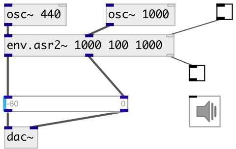

[index](index.html) :: [env](category_env.html)
---

# env.asr2~

###### stereo Attack/Sustain/Release envelope generator

*available since version:* 0.9.7

---

## arguments:

* **ATTACK**
attack time 
_type:_ float 
_units:_ ms 

* **SUSTAIN**
sustain level (percentage of trigger) 
_type:_ float 
_units:_ % 

* **RELEASE**
release time 
_type:_ float 
_units:_ ms 

## methods:

* **play**
runs envelope and release it after specified time 
  __parameters:__
  - **[DUR]** duration 
    type: float  

* **reset**
reset envelope to initial state 

## properties:

* **@attack** 
Get/set attack time 
_type:_ float 
_units:_ ms 
_range:_ 0..100000 
_default:_ 10 

* **@sustain** 
Get/set sustain level - percent from trigger signal 
_type:_ float 
_units:_ % 
_range:_ 0..100 
_default:_ 100 

* **@release** 
Get/set release time 
_type:_ float 
_units:_ ms 
_range:_ 0..100000 
_default:_ 300 

* **@gate** 
Get/set trigger. If &gt; 0 - starts envelope. 
_type:_ float 
_range:_ 0..1 
_default:_ 0 

* **@asr** (readonly)
Get attack sustain release triplet 
_type:_ list 

* **@active** 
Get/set on/off dsp processing 
_type:_ bool 
_default:_ 1 

* **@osc** (initonly)
Get/set OSC server name to listen 
_type:_ symbol 

* **@id** (initonly)
Get/set OSC address id. If specified, bind all properties to /ID/env_asr2/PROP_NAME osc
address, if empty bind to /env_asr2/PROP_NAME. 
_type:_ symbol 

## inlets:

* first input signal 
_type:_ audio
* second input signal 
_type:_ audio
* float: 1 - start envelope, 0 - stop 
_type:_ control

## outlets:

* first output signal with applied envelope 
_type:_ audio
* second output signal with applied envelope 
_type:_ audio
* outputs 1 when attack phase finished, 0 - when release phase finished 
_type:_ control

## keywords:

[envelope](keywords/envelope.html)
[asr](keywords/asr.html)
[stereo](keywords/stereo.html)

**See also:**
[\[env.adsr~\]](env.adsr~.html)
[\[env.ar~\]](env.ar~.html)

**Authors:** Serge Poltavsky

**License:** GPL3 or later

