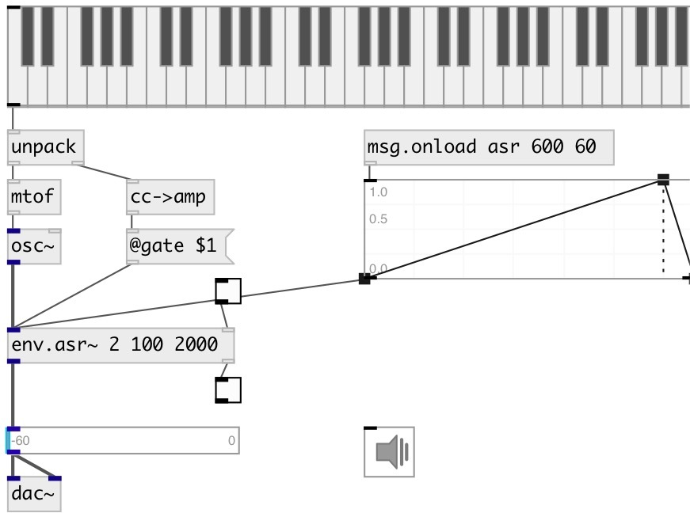

[index](index.html) :: [env](category_env.html)
---

# env.asr~

###### Attack/Sustain/Release envelope generator

*available since version:* 0.6

---

## arguments:

* **attack**
attack time 
__type:__ float 
__units:__ ms 

* **sustain**
sustain level (percentage of trigger) 
__type:__ float 
__units:__ % 

* **release**
release time 
__type:__ float 
__units:__ ms 

## methods:

* **play**
runs envelope and release it after specified time 
  __parameters:__
  - **[DUR]** duration 
    type: float  

* **reset**
reset envelope to initial state 

## properties:

* **@attack** 
Get/set attack time 
__type:__ float 
__units:__ ms 
__range:__ 0..100000 
__default:__ 10 

* **@sustain** 
Get/set sustain level - percent from trigger signal 
__type:__ float 
__units:__ % 
__range:__ 0..100 
__default:__ 100 

* **@release** 
Get/set release time 
__type:__ float 
__units:__ ms 
__range:__ 0..100000 
__default:__ 300 

* **@gate** 
Get/set trigger. If &gt; 0 - starts envelope. 
__type:__ float 
__range:__ 0..1 
__default:__ 0 

* **@asr** (readonly)
Get attack sustain release triplet 
__type:__ list 

* **@active** 
Get/set on/off dsp processing 
__type:__ int 
__enum:__ 0, 1 
__default:__ 1 

## inlets:

* input signal 
__type:__ audio 

## outlets:

* output signal with applied envelope
__type:__ audio 
* outputs 1 when attack phase finished, 0 - when release phase finished
__type:__ control 

## keywords:

[envelope](keywords/envelope.html)
[asr](keywords/asr.html)

**See also:**
[\[env.adsr~\]](env.adsr~.html)
[\[env.ar~\]](env.ar~.html)

**Authors:** Serge Poltavsky

**License:** GPL3 or later

