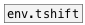

[< reference home](ceammc_lib.html)
---

# env.concat


Envelope concatenation

```


[bang(
|
[envelope adsr 10 40 20 50]
|
|      [loadbang]
|      |
|      [envelope ear 60 -4 30 2]
|      |.
[env.concat]
|
[env->array concat_array @resize]


[array concat_array w=300 h=100 yr=0..1]

            
```

---
arguments:


---
properties:


---
see also:<br>
[](env.tshift.html)
[](envelope.html)
