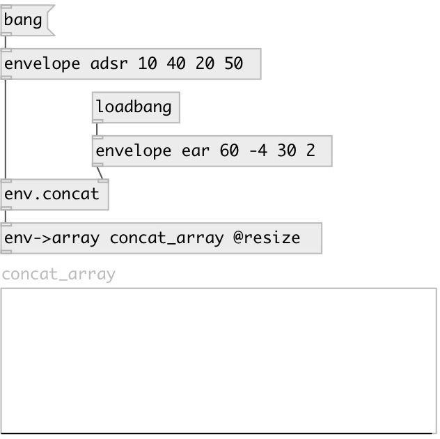

[index](index.html) :: [env](category_env.html)
---

# env.concat

###### Envelope concatenation

*available since version:* 0.5

---

## inlets:

* output concatenated result (previous) 
_type:_ control
* set second envelope (no output) 
_type:_ control

## outlets:

* new combined envelope 
_type:_ control

## keywords:

[concat](keywords/concat.html)

**See also:**
[\[env.tshift\]](env.tshift.html)
[\[envelope\]](envelope.html)

**Authors:** Serge Poltavsky

**License:** GPL3 or later

