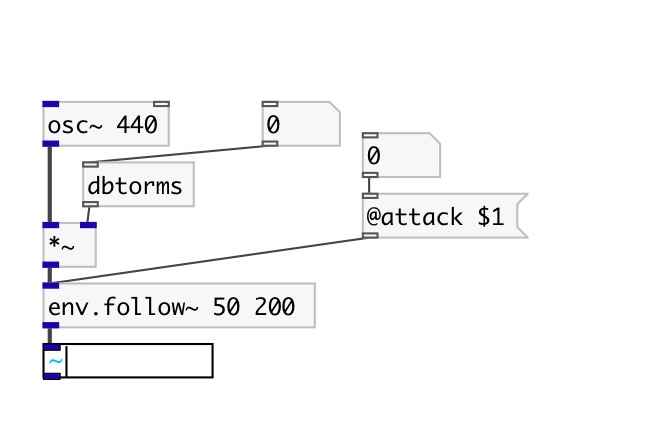

[< reference home](index.html)
---

# env.follow~

Envelope follower with independent attack and release times

---

 

---

---
arguments:

attack(ms): 
            attack time 
release(ms): 
            release time 

---
properties:

@attack: attack
            time 
@release: 
            release time 
@active: on/off dsp
            processing 

---
see also: 

