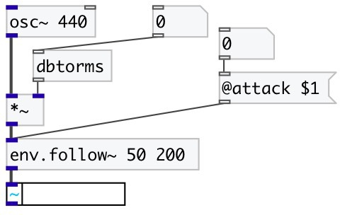

[index](index.html) :: [env](category_env.html)
---

# env.follow~

###### Envelope follower with independent attack and release times

*available since version:* 0.1

---

## arguments:

* **attack**
attack time 
__type:__ float 
__units:__ ms 

* **release**
release time 
__type:__ float 
__units:__ ms 

## properties:

* **@attack** 
Get/set attack time 
__type:__ float 
__range:__ 1..1000 
__default:__ 200 

* **@release** 
Get/set release time 
__type:__ float 
__range:__ 1..1000 
__default:__ 200 

* **@active** 
Get/set on/off dsp processing 
__type:__ int 
__enum:__ 0, 1 
__default:__ 1 

## inlets:

* input signal 
__type:__ audio 

## outlets:

* amplitude envelope that follows the absolute value going
            up/down
__type:__ audio 

## keywords:

[envelope](keywords/envelope.html)
[amplitude](keywords/amplitude.html)
[follower](keywords/follower.html)

**See also:**
[\[env.adsr~\]](env.adsr~.html)

**Authors:** Serge Poltavsky

**License:** GPL3 or later

