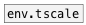

[<<< reference home](ceammc_lib.md)
---

# env.mix

```


[ui.knob] [loadbang #l]
|
|         [envelope adsr 10 15 80 100 #a]
|         |
|         |  [envelope adsr 20 40 10 60 #b]
|         |. |..
[env.mix        ]
|
[env->array mix_array @resize]


[array mix_array size=100 w=300 h=100 yr=0..1]

[X l->a] [X l->b]

            
```
---
Mix between two envelopes. Envelopes should contain equal number of
            segments
---
arguments:


---
properties:


---
see also:<br>
[](env.tscale.md)
[](envelope.md)
