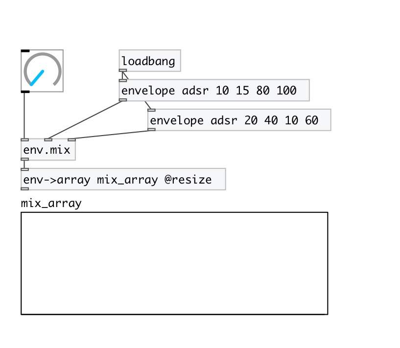

[< reference home](index.html)
---

# env.mix

Mix between two envelopes. Envelopes should contain equal number of
            segments

---

 

---

---
arguments:

---
properties:

---
see also: 

