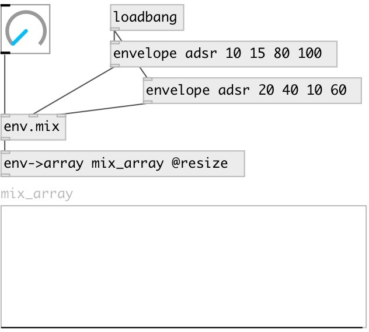

[index](index.html) :: [env](category_env.html)
---

# env.mix

###### Mix between two envelopes. Envelopes should contain equal number of
            segments

*available since version:* 0.5

---

## inlets:

* mix factor [0-1] 
_type:_ control
* first envelope 
_type:_ control
* second envelope 
_type:_ control

## outlets:

* mixed envelope 
_type:_ control

## keywords:

[mix](keywords/mix.html)

**See also:**
[\[env.tscale\]](env.tscale.html)
[\[envelope\]](envelope.html)

**Authors:** Serge Poltavsky

**License:** GPL3 or later

