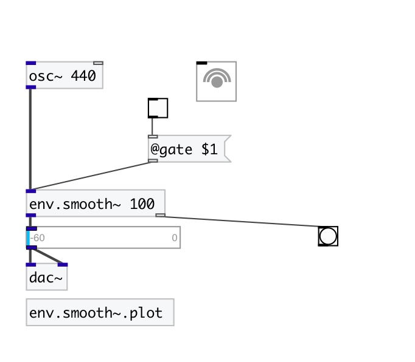

[< reference home](index.html)
---

# env.smooth~

An envelope with an exponential attack and release

---

 

---

---
arguments:

duration(ms): attack time 

---
properties:

@duration(ms): attack/release time 
@gate: trigger signal 
@active: on/off dsp
            processing 

---
see also: 

