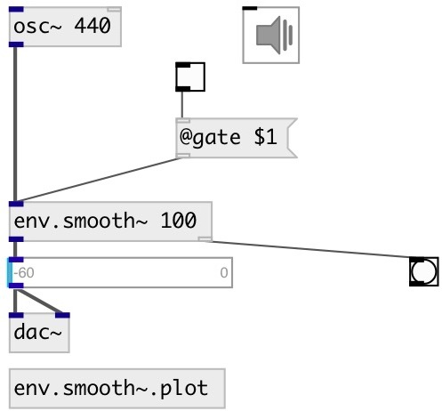

[index](index.html) :: [env](category_env.html)
---

# env.smooth~

###### An envelope with an exponential attack and release

*available since version:* 0.6

---

## arguments:

* **duration**
attack time 
__type:__ float 
__units:__ ms 

## methods:

* **play**
runs envelope and release it after specified time 
  __parameters:__
  - **[DUR]** duration 
    type: float  
    units: ms  

* **reset**
reset envelope to initial state 

## properties:

* **@duration** 
Get/set attack/release time (time to get -60db level) 
__type:__ float 
__units:__ ms 
__range:__ 0..100000 
__default:__ 100 

* **@gate** 
Get/set trigger signal 
__type:__ int 
__enum:__ 0, 1 
__default:__ 0 

* **@active** 
Get/set on/off dsp processing 
__type:__ int 
__enum:__ 0, 1 
__default:__ 1 

## inlets:

* input signal 
__type:__ audio 

## outlets:

* output signal with applied envelope
__type:__ audio 
* bang on done
__type:__ control 

## keywords:

[envelope](keywords/envelope.html)
[smooth](keywords/smooth.html)

**See also:**
[\[env.adsr~\]](env.adsr~.html)

**Authors:** Serge Poltavsky

**License:** GPL3 or later

