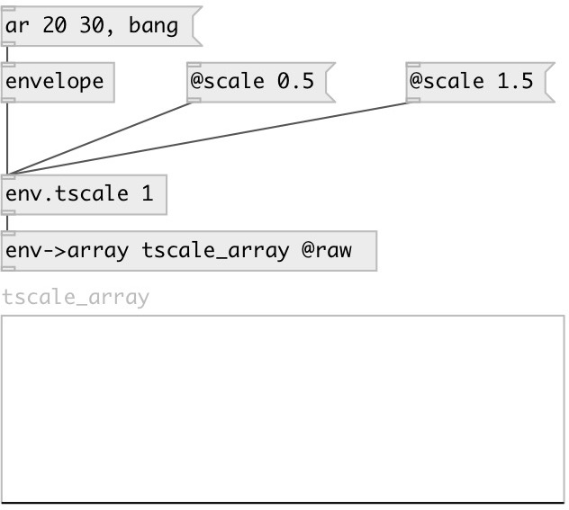

[index](index.html) :: [env](category_env.html)
---

# env.tscale

###### Envelope time-scale

*available since version:* 0.5

---

## arguments:

* **SCALE**
time-scale 
_type:_ float 

## properties:

* **@scale** 
Get/set time-scale 
_type:_ float 
_min value:_ 0 
_default:_ 1 

## inlets:

* input envelope 
_type:_ control

## outlets:

* scaled output envelope 
_type:_ control

## keywords:

[time](keywords/time.html)
[scale](keywords/scale.html)

**See also:**
[\[env.tshift\]](env.tshift.html)
[\[envelope\]](envelope.html)

**Authors:** Serge Poltavsky

**License:** GPL3 or later

