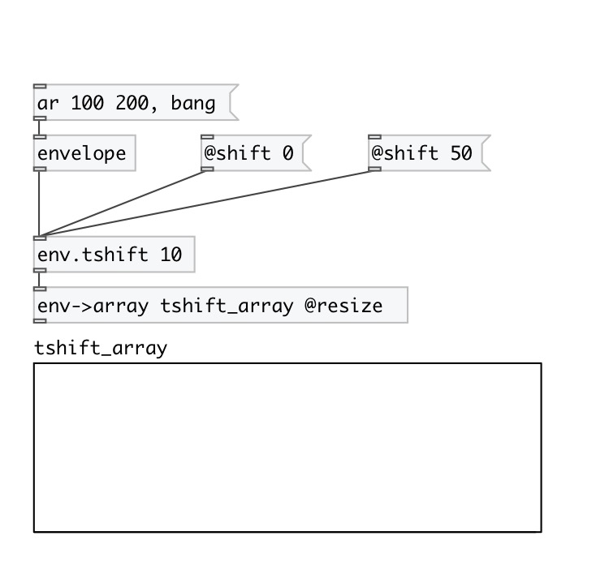

[index](index.html) :: [env](category_env.html)
---

# env.tshift

###### Envelope time-shift (horizontal)

*available since version:* 0.5

---

## arguments:

* **SHIFT**
time-shift 
_type:_ float 
_units:_ ms 

## properties:

* **@shift** 
Get/set time-shift 
_type:_ float 
_units:_ ms 
_default:_ 0 

## inlets:

* input envelope 
_type:_ control

## outlets:

* shifted output envelope 
_type:_ control

## keywords:

[time](keywords/time.html)
[shift](keywords/shift.html)

**See also:**
[\[env.tscale\]](env.tscale.html)
[\[envelope\]](envelope.html)

**Authors:** Serge Poltavsky

**License:** GPL3 or later

