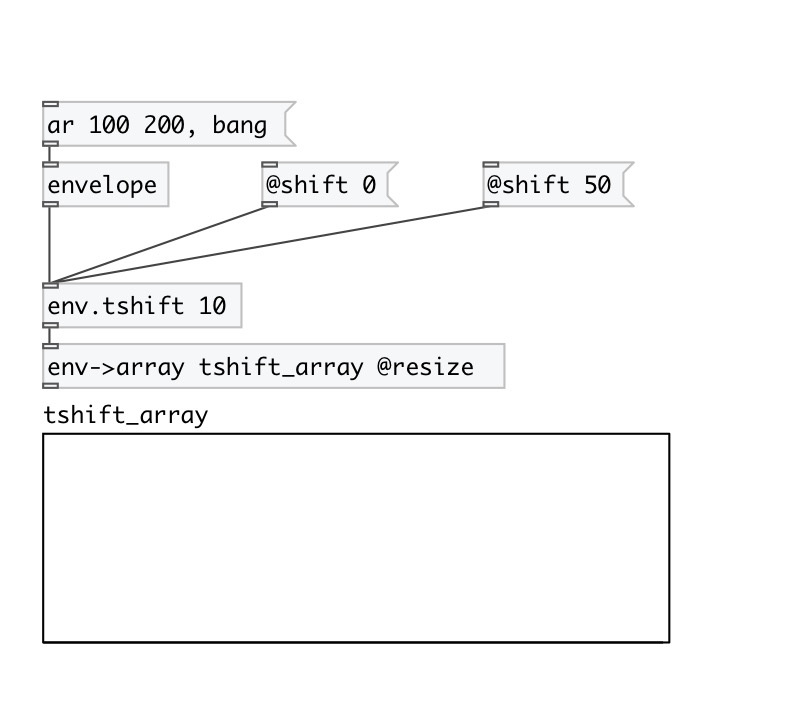

[< reference home](index.html)
---

# env.tshift

Envelope time-shift (horizontal)

---

 

---

---
arguments:

SHIFT(ms): time-shift 

---
properties:

@shift(ms): 
            time-shift 

---
see also: 

