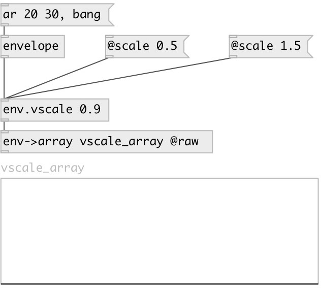

[index](index.html) :: [env](category_env.html)
---

# env.vscale

###### Envelope value-scale

*available since version:* 0.5

---

## arguments:

* **SCALE**
value-scale 
__type:__ float 

## properties:

* **@scale** 
Get/set value-scale 
__type:__ float 
__default:__ 1 

## inlets:

* input envelope 
__type:__ control 

## outlets:

* scaled output envelope
__type:__ control 

## keywords:

[value](keywords/value.html)
[scale](keywords/scale.html)

**See also:**
[\[env.tscale\]](env.tscale.html)
[\[envelope\]](envelope.html)

**Authors:** Serge Poltavsky

**License:** GPL3 or later

