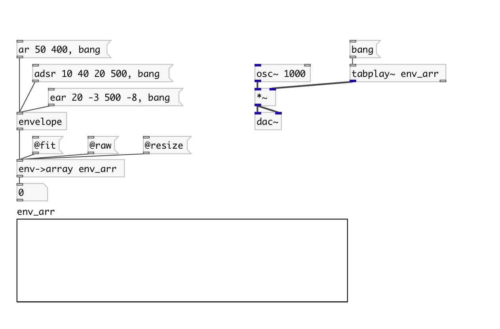

[< reference home](index.html)
---

# env2array

Renders envelope to specified array

---

 

---

---
arguments:

ARRAY: array name 

---
properties:

@array: target array name 
@redraw: redraw after array
            change 
@mode: rendering
            mode: *fit* to array size, *resize* array to envelope length or *raw* render while
            enough space in array 
@fit: alias to @mode fit property 
@resize: alias to @mode resize property 
@raw: alias to @mode raw property 

---
see also: 

