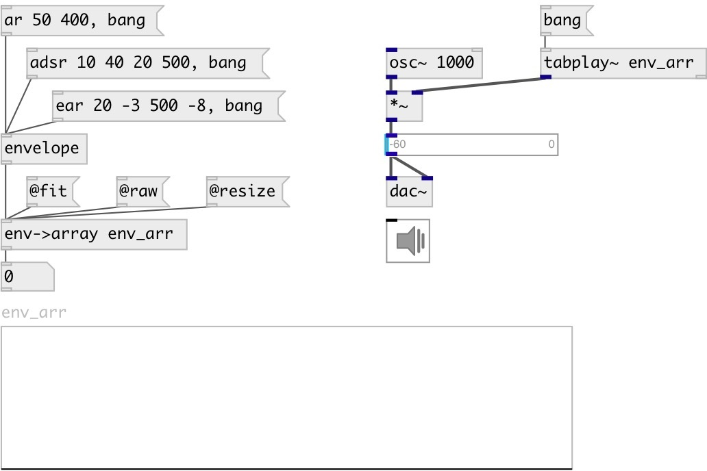

[index](index.html) :: [env](category_env.html)
---

# env2array

###### Renders envelope to specified array

*available since version:* 0.5

---

## arguments:

* **ARRAY**
array name 
__type:__ symbol 

## properties:

* **@array** 
Get/set target array name 
__type:__ symbol 

* **@redraw** 
Get/set redraw after array change 
__type:__ int 
__enum:__ 0, 1 
__default:__ 1 

* **@mode** 
Get/set rendering mode: *fit* to array size, *resize* array to envelope length or *raw*
render while enough space in array 
__type:__ symbol 
__enum:__ fit, resize, raw 
__default:__ fit 

* **@fit** 
Get/set alias to @mode fit property 
__type:__ alias 

* **@resize** 
Get/set alias to @mode resize property 
__type:__ alias 

* **@raw** 
Get/set alias to @mode raw property 
__type:__ alias 

## inlets:

* *envelope* data 
__type:__ control 

## outlets:

* output number of samples in destination array. If array was resized - output
            this new size
__type:__ control 

## keywords:

[envelope](keywords/envelope.html)
[array](keywords/array.html)

**See also:**
[\[env-&gt;vline\]](env-%3Evline.html)

**Authors:** Serge Poltavsky

**License:** GPL3 or later

