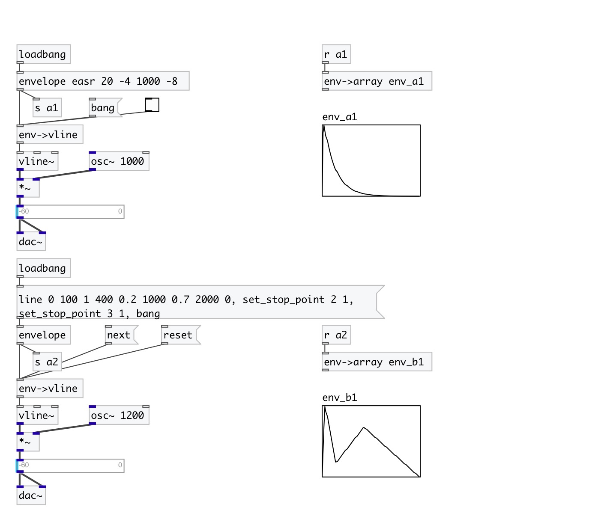

[index](index.html) :: [env](category_env.html)
---

# env2vline
**aliases:** [ceammc/env2vline], [ceammc/env-&gt;vline], [env-&gt;vline]

###### Converts envelope to bunch of vline messages

*available since version:* 0.5

---

## information
Supports stop-points for multisegment envelopes. Note: non-linear envelopes are outputted using linear approximation

## methods:

* **next**
output segment until next stop-point or end of envelope is reached 

* **reset**
reset current segment position for multi-segment envelopes 

## properties:

* **@sync** 
Get/set sync with input data. When set to 1 outputs envelope (as fixed) on every input
data 
_type:_ int 
_enum:_ 0, 1 
_default:_ 0 

## inlets:

* output as envelope of fixed length (no stop-points are encountered) 
_type:_ control

## outlets:

* bunch of vline-compatible messages: VALUE, DURATION, OFFSET 
_type:_ control

## keywords:

[envelope](keywords/envelope.html)
[vline](keywords/vline.html)

**See also:**
[\[vline-&gt;env\]](vline-%3Eenv.html)
[\[env-&gt;array\]](env-%3Earray.html)

**Authors:** Serge Poltavsky

**License:** GPL3 or later

