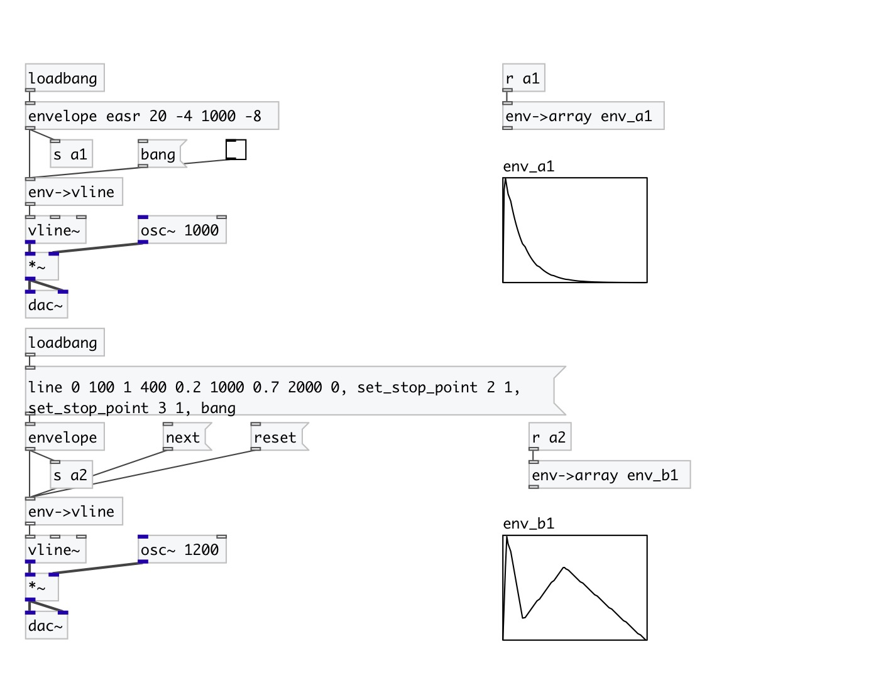

[< reference home](index.html)
---

# env2vline

Converts envelope to bunch of vline messages

---

Supports stop-points for multisegment envelopes. Note: non-linear envelopes are
            outputted using linear approximation
 

---

---
arguments:

---
properties:

@sync: sync with input data. When set
            to 1 outputs envelope (as fixed) on every input data 

---
see also: 

