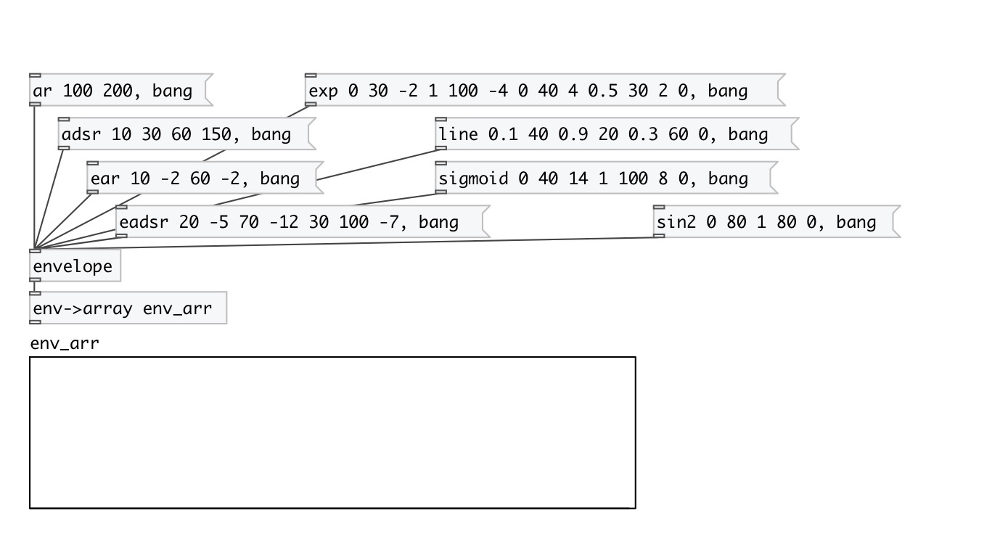

[< reference home](index.html)
---

# envelope

Envelope data type

---

Data type for sound envelope. Contains points specified by time and value. Points
            could have stop property - to execute oly part of envelope and stop on this point. So
            multisegment envelopes could be created
Point also has segment type property, that defines following segment curve - it
            could be *step*, *line* (default) or *exp* (exponential)
Exponential segment also has curve property: if 0 - (linear) &lt;0 (concave,
            negatively curved) &gt;0 (convex, positively curved)
 

---

---
arguments:

adsr: ADSR envelope: attack(ms), decay(ms), sustain(%),
            release(ms) 
asr: ASR envelope: attack(ms), release(ms) - with sustain
            stop point 
ar: AR envelope: attack(ms), release(ms) 
eadsr: exponential ADSR envelope: attack(ms), attack_curve,
            decay(ms), decay_curve, sustain(%), release(ms), release_curve 
easr: exponential ASR envelope: attack(ms), attack_curve,
            release(ms), release_curve - with sustain stop point 
ear: exponential ASR envelope: attack(ms), attack_curve,
            release(ms), release_curve - no sustain point 

---
properties:

@npoints: number of
            points 
@length(ms): total envelope time length 
@points: list of point times
            (ms) 
@values: list of point values 
@stops: list of stop points 

---
see also: 

