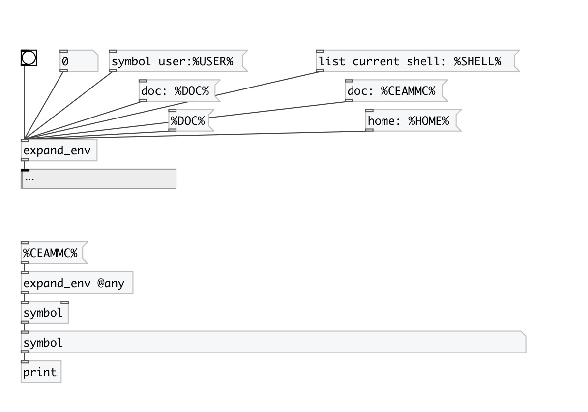

[< reference home](index.html)
---

# expand_env

Substitute enviroment variables in data stream

---

Environment variable %HOME% will be replaced by home user directory under
            UNIX
Some special variables defined: %DOC% - path to PureData doc directory, %CEAMMC% -
            path to ceammc library directory
 

---

---
arguments:

---
properties:

@any: if specified - also do substitution in message
            selector 

---
see also: 

