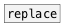

[< reference home](ceammc_lib.html)
---

# expand_env


Substitute enviroment variables in data stream

```


[B] [F]  [symbol user:%USER%( [list current shell: %SHELL%(
|   |    |                    |
|   |    |  [doc: %DOC%(      |  [doc: %CEAMMC%(
|   |    |  |                 |  |
|   |    |  |  [%DOC%(        |  | [home: %HOME%(
|   |    |  |  |              |  | |
[expand_env                        ]
|
[ui.display @display_type=1]


[%CEAMMC%(
|
[expand_env @any]
|
[symbol]
|
[S digits=70]
|
[print]

            
```

---
arguments:


---
properties:

@any: if specified - also do substitution in message
            selector<br>

---
see also:<br>
[](replace.html)
