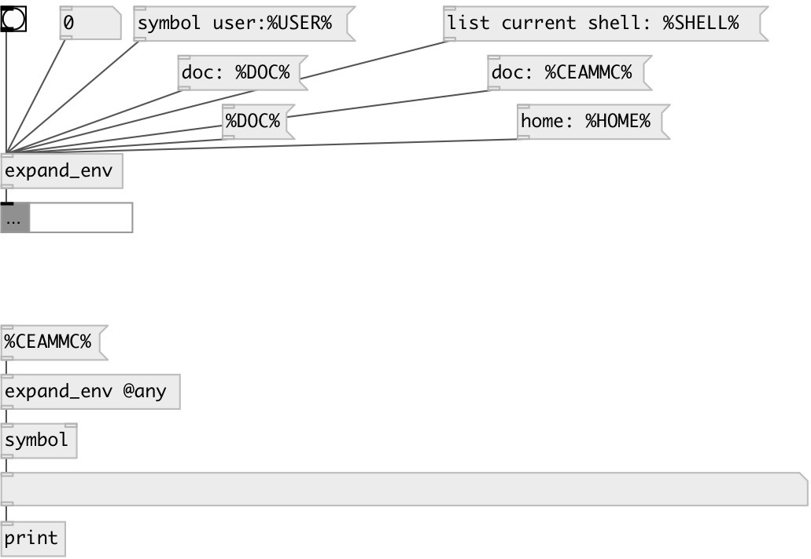

[index](index.html) :: [flow](category_flow.html)
---

# expand_env

###### Substitute environment variables in data stream

*available since version:* 0.1

---

## information
Environment variable %HOME% will be replaced by home user directory under
            UNIX
Some special variables defined: %DOC% - path to PureData doc directory, %CEAMMC% -
            path to ceammc library directory

## properties:

* **@any** 
Get/set if specified - also do substitution in message selector 
_type:_ flag 
_default:_ 0 

## inlets:

* passed 
_type:_ control

## outlets:

* output data stream 
_type:_ control

## keywords:

[expand_env](keywords/expand_env.html)
[test](keywords/test.html)

**See also:**
[\[replace\]](replace.html)

**Authors:** Serge Poltavsky

**License:** GPL3 or later

