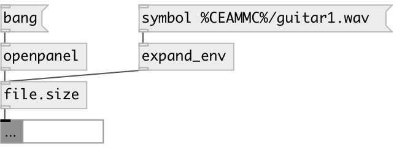

[index](index.html) :: [path](category_path.html)
---

# file.size

###### output file size

*available since version:* 0.9.4

---

## information
Note: by default filesize request performed asynchronously, so there&#39;s a (usually)
            short delay between input and output

## properties:

* **@async** 
Get/set async mode 
__type:__ int 
__enum:__ 0, 1 
__default:__ 1 

* **@sync** 
Get/set alias for @async 0 
__type:__ alias 

## inlets:

* file path 
__type:__ control 

## outlets:

* float: size in bytes
__type:__ control 

## keywords:

[path](keywords/path.html)
[file](keywords/file.html)
[size](keywords/size.html)

**Authors:** Serge Poltavsky

**License:** GPL3 or later

