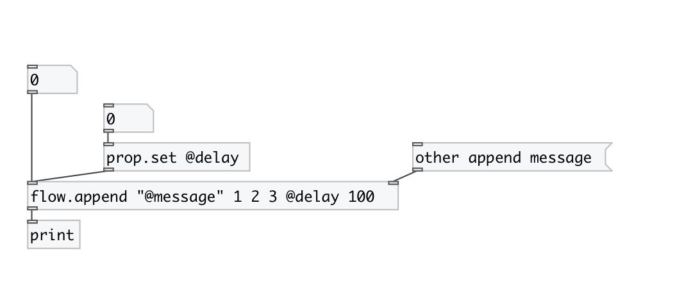

[< reference home](index.html)
---

# flow.append

inject message into flow

---

 

---

---
arguments:

VAL: append value 

---
properties:

@delay(ms): 
            message delay. If &gt; 0 schedules message output in the future, if == 0 - send in next
            time tick, if &lt; 0 - output immidiately 
@msg: output as message, not as list (by
            default) 
@value: append value 

