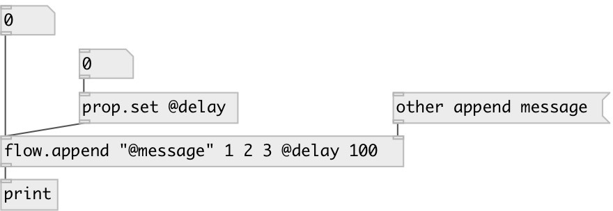

[index](index.html) :: [flow](category_flow.html)
---

# flow.append

###### append message to flow stream

*available since version:* 0.9

---

## information
Note: if you want to specify property message in the init argument, you have to quote it with double-quotes

## arguments:

* **MSG**
init value for appended message 
_type:_ list 

## properties:

* **@delay** 
Get/set append delay. If &lt;0 append immediately at the same logical time, if equal zero
- output after next DSP block. 
_type:_ float 
_units:_ ms 
_min value:_ -1 
_default:_ -1 

* **@msg** 
Get/set appended message 
_type:_ list 

## inlets:

* input message 
_type:_ control
* set append value 
_type:_ control

## outlets:

* output message 
_type:_ control

## keywords:

[flow](keywords/flow.html)
[append](keywords/append.html)

**See also:**
[\[flow.prepend\]](flow.prepend.html)

**Authors:** Serge Poltavsky

**License:** GPL3 or later

